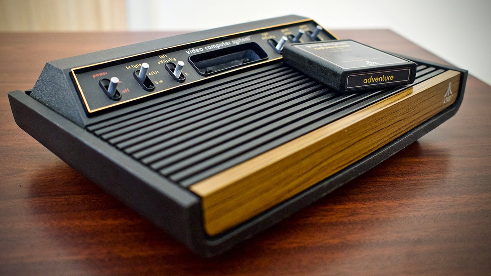
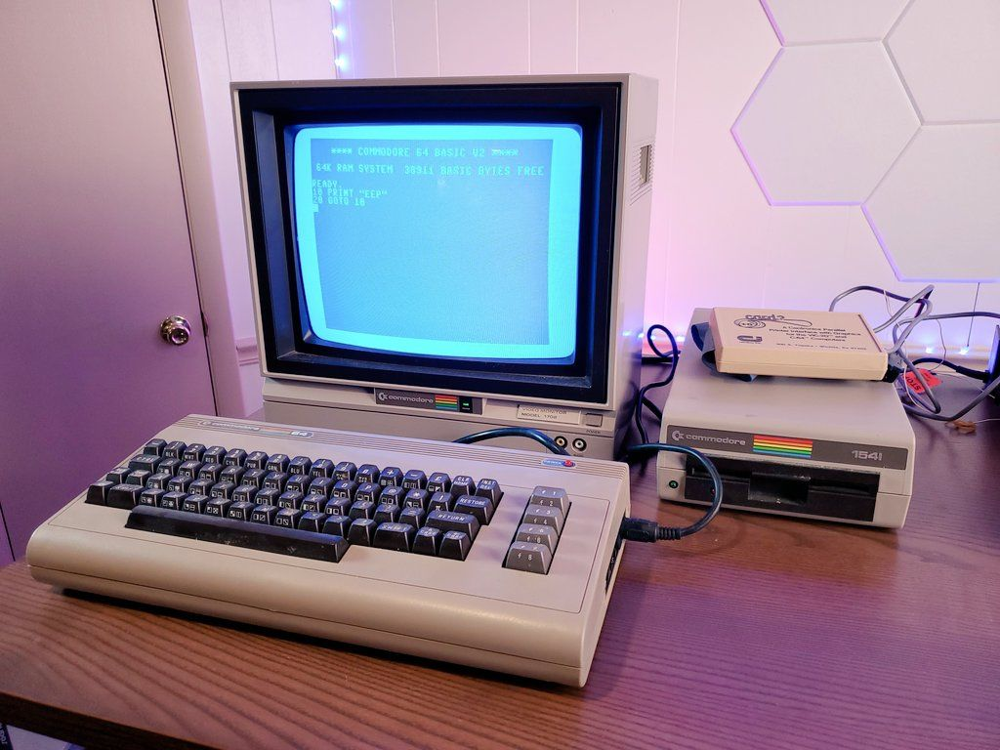
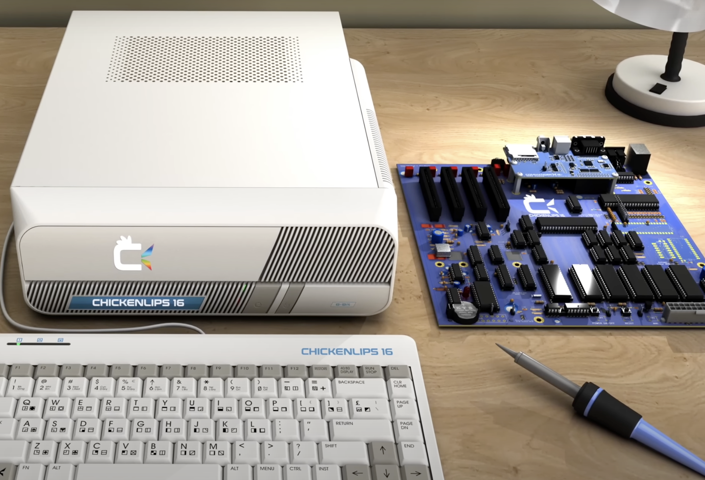
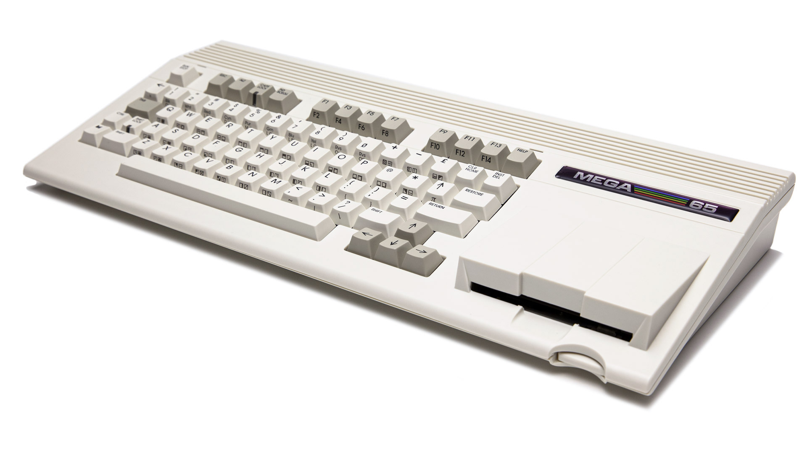

# C++ and the 6502

1. Emulating it
1. Targeting it (using C++)
1. (Assembling for it)

<!-- 
Originally first part. Now also second.
Because: FUN and the new llvm 6502 backend
-->
---

# The 6502

<!-- 
Created by Chuck Peddle. 1975. Replacement for the Motorola 6800.

CHEAP!

There's a whole story, books etc, but not for us.

-->
---

## Atari 2600



<!-- 128 byte memory, 5 byte VRAM -->

---
## Apple II


---

## Nintendo


<!-- CPU based on 6502, no decimal mode -->
---

## C64



<!-- 6510, IO at $0/1, (tristate bus) -->

---

## New machines

<!-- 65c02, more opcodes, 450w vs 20w -->
---


## Commander X16



<!-- Pre order 350 dollars, board only -->
---

## Mega 65 



<!-- Pre order 800 euro -->

---

# Emulation

---
<!--
Investigating wether you can write traditionally size/performance
sensitive code without macros, redundant code and other ugliness

Who was tried writing an emulator, or thought about it?

-->

* Three 8-bit registers (A,X,Y)
* Around 155 opcodes (56 instructions)
* Opcodes 1-3 bytes long
* Uniquely identified by first byte

<!--
Makes it really easy to start an emulator!
-->
---

##### LDA (LoaD Accumulator)

```
Affects Flags: N Z

MODE           SYNTAX       HEX LEN TIM
Immediate     LDA #$44      $A9  2   2
Zero Page     LDA $44       $A5  2   3
Zero Page,X   LDA $44,X     $B5  2   4
Absolute      LDA $4400     $AD  3   4
Absolute,X    LDA $4400,X   $BD  3   4+
Absolute,Y    LDA $4400,Y   $B9  3   4+
Indirect,X    LDA ($44,X)   $A1  2   6
Indirect,Y    LDA ($44),Y   $B1  2   5+

+ add 1 cycle if page boundary crossed
```
  
---

I wanted to see if I could write a 6502 emulator...

* Using modern C++
* Without any _macros_ or _ifdefs_
* Being as fast or _faster_ than earlier emulators
* Being more _configurable_ than earlier emulators.

<!-- Compare to vice etc; all C, lots of macros -->

---

## Jump table or switch statement ?
<!-- 
C-Style. Vice.
-->
---

```c
while (...) {
    op = *pc++;
    switch (op) {
    case OPCODE:
        // .. 
        break;
    }
}
```

```c
while (...) {
    op = *pc++;
    jumpTable[op](state);
}
```
<!--
One unpredictable + one predicatable jump

Big cost is passing state. Member function?
-->
---

## Intermission: _mruby_

---

### Direct Threaded Code

<!--
mruby vm.c:1008

Why this may not be good idea (any more)?

Larger code vs cache vs one predictable jump
-->
---

```cpp
MRB_API mrb_value
mrb_vm_exec(mrb_state *mrb, ...) 
{
#ifdef DIRECT_THREADED
  static const void * const optable[] = {
#include "mruby/ops.h"
  };
#endif
  ...

  INIT_DISPATCH {
    CASE(OP_NOP, Z) {
      /* do nothing */
      NEXT;
    }

    CASE(OP_MOVE, BB) {
      regs[a] = regs[b];
      NEXT;
    }
    ...
    L_STOP:
      return;
  }
  END_DISPATCH;
```

---

```cpp
#ifndef DIRECT_THREADED

#define INIT_DISPATCH for (;;) { insn = *pc; switch (insn) {
#define CASE(insn,ops) case insn: pc++; FETCH_ ## ops (); \
                       mrb->c->ci->pc = pc; L_ ## insn ## _BODY:
#define NEXT goto L_END_DISPATCH
#define JUMP NEXT
#define END_DISPATCH L_END_DISPATCH:;}}

#else
```
...

---

```c
#define INIT_DISPATCH JUMP; return mrb_nil_value();
#define CASE(insn,ops) L_ ## insn: pc++; FETCH_ ## ops (); \
                       mrb->c->ci->pc = pc; L_ ## insn ## _BODY:
#define NEXT insn=*pc; goto *optable[insn]
#define JUMP NEXT

#define END_DISPATCH
```

---
Jump table! because...

* Better code separation
* Allows for templated function calls

---

```cpp
class Machine {
    using OpFunc = void (*op)(Machine&);

    std::array<OpFunc, 256> jumpTable;
    uint16_t pc = 0;
    int cycles = 0;
    std::array<uint8_t, 65536> memory;
    
    // ...

    void run(int numOpcodes) {
        while (numOpcodes--) {
            auto code = memory[pc++];
            jumpTable[code](*this);
        }
    }
}
```
---

## Example opcode: **TAX**

---
```c++
    template <int FROM, int TO>
    static constexpr void Transfer(Machine& m)
    {
        m.Reg<TO>() = m.Reg<FROM>();
        if constexpr (TO != SP) m.set<SZ>(m.Reg<TO>());
    }

    template <int REG> constexpr auto& Reg()
    {
        if constexpr (REG == A) return a;
        if constexpr (REG == X) return x;
        if constexpr (REG == Y) return y;
        if constexpr (REG == SP) return sp;
    }

    template <int BITS> void set(int res, int arg = 0)
    {
        sr &= ~BITS;

        if constexpr ((BITS & S) != 0) sr |= (res & 0x80);
        if constexpr ((BITS & Z) != 0) sr |= (!(res & 0xff) << 1);
        if constexpr ((BITS & C) != 0) sr |= ((res >> 8) & 1);
        if constexpr ((BITS & V) != 0)
            sr |= ((~(a ^ arg) & (a ^ res) & 0x80) >> 1);
    }
```
---

And here are our jump table entries;

```c++
    { "tax", { { 0xaa, 2, NONE, Transfer<A, X> } } },
    { "txa", { { 0x8a, 2, NONE, Transfer<X, A> } } },
    { "tay", { { 0xa8, 2, NONE, Transfer<A, Y> } } },
    { "tya", { { 0x98, 2, NONE, Transfer<Y, A> } } },
    { "txs", { { 0x9a, 2, NONE, Transfer<X, SP> } } },
    { "tsx", { { 0xba, 2, NONE, Transfer<SP, X> } } },
```
---
## Benchmarking
---

## Intermission - it used to be so easy!

---

```asm

    inc $d020
    jsr draw_line
    dec $d020

```


---

[Zydis](https://github.com/zyantific/zydis) 

---

```c++
    Result r;
    while (decoder.decodeInstruction(info)) {
    
        if (info.mnemonic >= InstructionMnemonic::JA &&
            info.mnemonic <= InstructionMnemonic::JS)
            r.jumps++;

        switch (info.mnemonic) {
        case InstructionMnemonic::RET: return r;
        case InstructionMnemonic::CALL: r.calls++; break;
        default: break;
        }
        r.opcodes++;
    }
```

---

```bash
$ build/sixfive -O
### AVG OPCODES: 21 TOTAL OPS/CALLS/JUMPS: 3306/0/4
$
```

```bash
rti (34/0/1)
rts (13/0/1)
plp (22/0/1)
bmi (14/0/1)
```

<!--
Here we see that our 156 functions disassembles to 3306 x86 opcodes in
total.

Interestingly we also have 4 branches. The full output show the four
offending functions;
-->

---

```c++
#define LDA(value, clk_inc, pc_inc) \
    do {                            \
        BYTE tmp = (BYTE)(value);   \
        reg_a_write(tmp);           \
        CLK_ADD(CLK, (clk_inc));    \
        LOCAL_SET_NZ(tmp);          \
        INC_PC(pc_inc);             \
    } while (0)

#define LDX(value, clk_inc, pc_inc) \
    do {                            \
        reg_x_write((BYTE)(value)); \
        LOCAL_SET_NZ(reg_x_read);   \
        CLK_ADD(CLK, (clk_inc));    \
        INC_PC(pc_inc);             \
    } while (0)

#define LDY(value, clk_inc, pc_inc) \
    do {                            \
        reg_y_write((BYTE)(value)); \
        LOCAL_SET_NZ(reg_y_read);   \
        CLK_ADD(CLK, (clk_inc));    \
        INC_PC(pc_inc);             \
    } while (0)
```

---

```c++
    case 0xa0:          /* LDY #$nn */
        LDY(p1, 0, 2);
        break;

    case 0xa1:          /* LDA ($nn,X) */
        LDA(LOAD_IND_X(p1), 1, 2);
        break;

    case 0xa2:          /* LDX #$nn */
        LDX(p1, 0, 2);
        break;
```

---

```c++
    template <int REG, int MODE>
    static constexpr void Load(Machine& m)
    {
        m.Reg<REG>() = m.LoadEA<MODE>();
        m.set_SZ<REG>();
    }
```

```c++
    { 0xa0, 2, IMM, Load<Y, IMM>},
    { 0xa1, 6, INDX, Load<A, INDX>},
    { 0xa2, 2, IMM, Load<X, IMM>},
```

---

# Targeting 6502 with C++ 

<!-- 
llvm-mos project

Started 2021 ?

-->

---

## memcpy

```cpp
void memcpy(char*dst, char* src, short len)
{
    while(len--) {
        *dst++ = *src++;
    }
}
```

```cpp
void memcpy(char*dst, char* src, short len)
{
    for(int i = 0; i<len; i++) {
        dst[i] = src[i];
    }
}
```

<!-- 
-->

---

```asm
memcpy:
        sta     __rc6
        txa
        bne     .LBB0_2
        lda     __rc6
        beq     .LBB0_11
.LBB0_2:
        ldy     #0
        jmp     .LBB0_4
.LBB0_3:
        inc     __rc3
        txa
        beq     .LBB0_10
.LBB0_4:
        lda     #255
        dec     __rc6
        cmp     __rc6
        bne     .LBB0_6
        dex
.LBB0_6:
        lda     (__rc4),y
        inc     __rc4
        bne     .LBB0_8
        inc     __rc5
.LBB0_8:
        sta     (__rc2),y
        inc     __rc2
        beq     .LBB0_3
        txa
        bne     .LBB0_4
.LBB0_10:
        lda     __rc6
        bne     .LBB0_4
.LBB0_11:
        rts
```

---

```asm
        ldx     16384
        stx     32768
        ldx     16385
        stx     32769
        ldx     16386
        stx     32770
        ...
```

<!-- 
    Unrolls for len <= 28
-->

---

```asm
        ldx     #0
.LBB1_1:
        lda     16384,x
        sta     32768,x
        inx
        cpx     #50
        bne     .LBB1_1
```

<!-- 
    Nice loop for len <= 256. Then bad.
-->

---
```asm
    ldx #0
.loop
    lda $2000,x
    sta $3000,x
    lda $2100,x
    sta $3100,x
    ...
    dex
    beq .loop
```

<!-- 
What we actually want. Can maybe be accomplished with TMP forced loop
unrolling tricks.
-->

---

```asm
!macro MemMove(dest, src, len)
{
    !if (src + len < dest) || (dest + len < src) {
        FastCopy(dest, src, len)
    } else {
        !if dest > src {
            MemCpyBack(dest, src, len)
        } else {
            MemCpyForward(dest, src, len)
        }
    }
}
```

---

```asm
!macro FastCopy(dest, src, len) {
    .blocks = len >> 8
    .rest = len & 0xff

    !if .blocks > 0 {
        ldx #0
    .a  !rept .blocks {
            lda src + i * $100, x
            sta dest + i * $100, x
        }
        inx
        bne .c
    }
    .c
    !if .rest > 1 {
        ldx #.rest-1
    .b  lda src + .blocks * $100,x
        sta dest + .blocks * $100,x
        dex
        bne .b
    }
    !if .rest > 0 {
        lda src + .blocks
        sta dest + .blocks
    }
}
```

---

```
*** Test 'copy' : 410503 cycles, [A=$ff X=$00 Y=$00]
*** Test 'fastcopy' : 91873 cycles, [A=$00 X=$00 Y=$00]
```
<!-- 

Appropox 50 bytes vs 250 bytes code foot print

-->

---

## Put pixel

```c++
void put_pixel(int x, int y)
{
    char* vram = 0x8000;
    vram[(y>>3)*320+y + (x&0xf8)] |= (0x80>>(x&7));
}
```
<!-- 
    We really want x & y to be 8 bit and extend to 16 bit
-->
---

```asm

put_pixel:
        sta     mos8(.Lput_pixel_zp_stk+4) 
        stx     mos8(.Lput_pixel_zp_stk+2)
        ldx     __rc2
        stx     mos8(.Lput_pixel_zp_stk+1)
        ldx     __rc3
        stx     mos8(.Lput_pixel_zp_stk)
        and     #7
        ldx     #0
        sta     __rc2
        lda     #128
        jsr     __lshrhi3
        sta     mos8(.Lput_pixel_zp_stk+3)
        lda     mos8(.Lput_pixel_zp_stk)
        sta     mos8(.Lput_pixel_zp_stk)
        cmp     #128
        ror
        ldx     mos8(.Lput_pixel_zp_stk+1)
        stx     __rc4
        ror     __rc4
        cmp     #128
        ror
        ror     __rc4
        cmp     #128
        ror
        ror     __rc4
        ldx     #1
        ldy     #64
        sty     __rc2
        stx     __rc3
        tax
        lda     __rc4
        jsr     __mulhi3
        sta     __rc2
        stx     __rc3
        ldx     mos8(.Lput_pixel_zp_stk+4)
        txa
        and     #248
        tay
        lda     mos8(.Lput_pixel_zp_stk+2)
        and     #1
        sta     __rc4
        ldx     mos8(.Lput_pixel_zp_stk+1)
        stx     __rc5
        tya
        clc
        adc     __rc5
        sta     __rc5
        lda     __rc4
        ldx     mos8(.Lput_pixel_zp_stk)
        stx     __rc4
        adc     __rc4
        sta     __rc4
        lda     __rc5
        clc
        adc     __rc2
        tax
        lda     __rc4
        adc     __rc3
        sta     __rc2
        ldy     #0
        sty     __rc3
        txa
        clc
        adc     __rc3
        sta     __rc4
        lda     #64
        adc     __rc2
        sta     __rc5
        lda     mos8(.Lput_pixel_zp_stk+3)
        ora     (__rc4),y
        sta     (__rc4),y
        rts
```

---

```asm
fast_plot:

    lda lookup_lo,y
    sta target
    lda lookup_hi,y
    sta target+1
    txa
    and #$f8
    tay
    lda lookup_mask,x
    ora (target),y
    sta (target),y
    rts

yoffset = [y -> (y>>3) * 40 * 8 + (y&7) + SCREEN ]

lookup_lo:
    !rept 256 { !byte yoffset(i) }
lookup_hi:
    !rept 256 { !byte yoffset(i) >> 8 }
lookup_mask:
    !rept 256 { !byte (1<<(7-(i&7))) }
```
